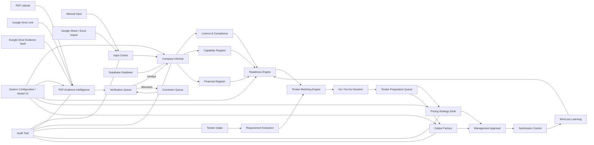

# 01 — Master Ecosystem Flow

## Purpose

Gambaran besar keseluruhan platform daripada data masuk sehingga tender submission dan win/loss learning.

## Main Modules

1. Input Centre
2. PDF Evidence Intelligence
3. Company InfoHub
4. Licence & Compliance
5. Readiness Engine
6. Tender Intake
7. Tender Matching
8. Pricing Strategy Desk
9. Output Factory
10. Approval & Submission
11. Config, Audit and Data Layer

## Workflow Diagram

## Output

- Master ecosystem map
- Development direction
- Integration reference between modules