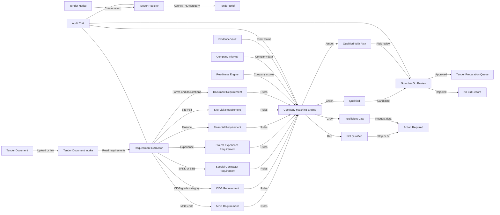

# 05 — Tender Intake & Matching Module

## Purpose

Modul ini mengurus proses tender dari saat notis/dokumen tender diterima sehingga sistem boleh mencadangkan syarikat yang paling sesuai untuk masuk tender.

Fokus utama:

- daftar tender baru;
- pecahkan syarat tender kepada requirement yang boleh disemak;
- padankan syarat tender dengan Company Passport, MOF, CIDB, evidence, finance dan pengalaman;
- hasilkan status kelayakan Green / Amber / Red / Grey;
- sediakan Go / No-Go recommendation untuk management.

## Sub-Modules

1. Tender Register
2. Tender Document Intake
3. Requirement Extraction
4. Site Visit Register
5. Closing Date Tracker
6. Mandatory Requirement Checklist
7. Agency / PTJ Register
8. Tender Category Mapping
9. Company Matching Engine
10. Go / No-Go Review

## Workflow



## Key Database Tables

- `tender_intakes`
- `tender_documents`
- `tender_requirements`
- `tender_requirement_items`
- `tender_site_visits`
- `tender_matches`
- `tender_match_results`
- `go_no_go_decisions`
- `audit_logs`

## UI Routes

```text
/tenders
/tenders/new
/tenders/[id]
/tenders/[id]/requirements
/tenders/[id]/matching
/tenders/[id]/go-no-go
```

## API Functions

- create tender intake
- upload/link tender document
- extract requirement checklist
- match tender to company portfolio
- generate Green / Amber / Red / Grey result
- submit Go / No-Go recommendation
- record management decision

## Output Generated

- Tender Brief
- Tender Requirement Checklist
- Company Match Ranking
- Go / No-Go Memo
- Tender Risk Report
- Tender Preparation Queue

## DONE -> NEXT STEP

Selepas modul ini stabil, sambung kepada Pricing Strategy Desk dan Output Factory supaya tender yang diluluskan boleh diproses sehingga submission-ready.
