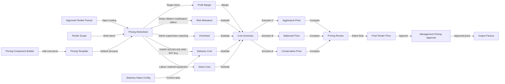
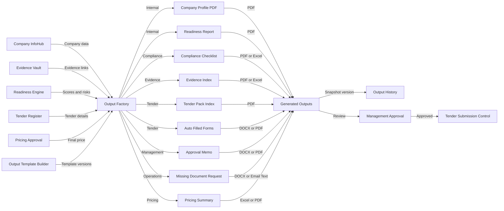

# 06 — Pricing, Output & Submission Module

## Purpose

Modul ini mengurus tender yang telah diluluskan untuk dikejar, bermula daripada pecahan harga sehingga dokumen submission-ready dihasilkan dan diluluskan.

Fokus utama:

- pecahan kos tender secara terkawal;
- statutory rate dan pricing component boleh dikemaskini;
- final price perlu melalui management approval;
- output tender pack dijana daripada data dan evidence yang verified;
- submission record dan win/loss learning disimpan.

## Sub-Modules

1. Pricing Worksheet
2. Costing Template
3. Direct Cost
4. Statutory Cost
5. Overhead
6. Risk Allowance
7. Profit Margin
8. Scenario Pricing
9. Output Factory
10. Tender Pack Generator
11. Final Approval
12. Submission Control
13. Win/Loss Analysis

## Pricing Workflow



## Output & Submission Workflow



## Key Database Tables

- `pricing_templates`
- `pricing_components`
- `pricing_worksheets`
- `pricing_items`
- `statutory_rates`
- `pricing_approvals`
- `output_template_definitions`
- `output_template_versions`
- `generated_outputs`
- `submission_records`
- `win_loss_analysis`
- `audit_logs`

## UI Routes

```text
/pricing
/pricing/templates
/tenders/[id]/pricing
/outputs
/outputs/templates
/tenders/[id]/outputs
/tenders/[id]/submission
```

## API Functions

- create pricing worksheet
- calculate direct/statutory/overhead/risk/profit
- save scenario pricing
- submit final price for approval
- generate output from template version
- save generated output snapshot
- record final submission
- record tender result and win/loss analysis

## Output Generated

- Pricing Worksheet
- Cost Breakdown
- Margin Simulation
- Final Price Approval Memo
- Company Profile PDF
- Compliance Checklist
- Evidence Index
- Tender Pack Index
- Auto-Filled Forms
- Submission Record
- Win/Loss Learning Report

## DONE -> NEXT STEP

Modul ini perlu bergantung kepada verified company data, verified evidence, tender requirement dan approved pricing. Output tidak boleh dijana daripada data yang belum disemak kecuali ditanda sebagai draft.
