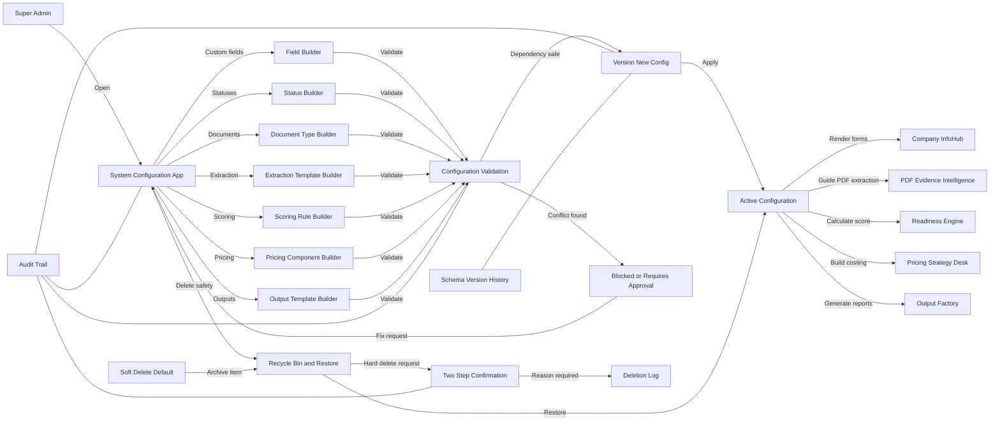

# 07 — Config, Governance & Modul 13

## Purpose

Modul ini menjadikan sistem config-driven, versioned, auditable, reversible dan dependency-safe. Ia membuang sifat hardcoded supaya field, status, document type, scoring, pricing component dan output template boleh diubah melalui UI tanpa ubah kod.

Prinsip utama:

```text
CONFIGURE -> VALIDATE -> VERSION -> APPLY -> AUDIT -> REVERSIBLE
```

## Sub-Modules

1. Field Builder
2. Status Builder
3. Document Type Builder
4. Extraction Template Builder
5. Scoring Rule Builder
6. Pricing Component Builder
7. Output Template Builder
8. Schema Versioning
9. Soft Delete / Recycle Bin / Restore
10. Dependency Check
11. Permission Control
12. Audit Trail

## Workflow



## Key Database Tables

- `field_groups`
- `field_definitions`
- `field_values`
- `status_definitions`
- `document_type_definitions`
- `extraction_templates`
- `scoring_rules`
- `scoring_weights`
- `scoring_versions`
- `pricing_components`
- `statutory_rates`
- `pricing_templates`
- `output_template_definitions`
- `output_template_versions`
- `schema_versions`
- `recycle_bin`
- `deletion_log`
- `audit_logs`
- `role_permissions`

## UI Routes

```text
/config
/config/fields
/config/statuses
/config/document-types
/config/extraction-templates
/config/scoring
/config/pricing-components
/config/output-templates
/config/schema-versions
/config/recycle-bin
/audit
```

## Permission Rule

| Role | Ubah Struktur | CRUD Data | Hard Delete |
|---|---:|---:|---:|
| Super Admin | Yes | Yes | Yes |
| Compliance Officer | No | Limited | No |
| Tender Executive | No | Tender only | No |
| Pricing Officer | No | Pricing only | No |
| Data Entry | No | Add/Edit | No |
| Read Only | No | No | No |

## Safety Rules

- Delete default ialah soft archive.
- Hard delete hanya Super Admin.
- Hard delete wajib sebab, two-step confirmation dan audit log.
- Item yang ada dependency aktif tidak boleh dipadam tanpa override rule.
- Generated output, audit log dan deletion log tidak boleh dipadam secara biasa.
- Semua perubahan struktur perlu schema version.

## Output Generated

- Config Version Report
- Schema Change Log
- Deleted Item Log
- Restore History
- Permission Matrix
- Audit Trail Export

## DONE -> NEXT STEP

Modul 13 perlu dibina awal selepas Company InfoHub core supaya modul lain tidak menjadi hardcoded.
