# 08 — Data Architecture ERD

## Purpose

Dokumen ini menerangkan struktur data induk untuk Supabase. Database perlu menyokong Company InfoHub, Evidence Vault, Dynamic Field Engine, Tender Matching, Pricing, Output Factory, Audit Trail dan Recycle Bin.

Prinsip:

- core identity fixed;
- operational detail boleh dynamic;
- semua evidence ada source link;
- output simpan snapshot version;
- audit dan deletion log kekal sebagai sejarah operasi.

## ERD

```mermaid
erDiagram
  COMPANIES ||--o{ COMPANY_PROFILES : has
  COMPANIES ||--o{ COMPANY_DIRECTORS : has
  COMPANIES ||--o{ COMPANY_SHAREHOLDERS : has
  COMPANIES ||--o{ LICENCES : has
  COMPANIES ||--o{ PROJECT_EXPERIENCE : has
  COMPANIES ||--o{ STAFF_PERSONNEL : has
  COMPANIES ||--o{ DOCUMENTS : owns
  COMPANIES ||--o{ FIELD_VALUES : stores

  FIELD_GROUPS ||--o{ FIELD_DEFINITIONS : groups
  FIELD_DEFINITIONS ||--o{ FIELD_VALUES : defines
  DOCUMENT_TYPE_DEFINITIONS ||--o{ DOCUMENTS : classifies
  DOCUMENT_TYPE_DEFINITIONS ||--o{ EXTRACTION_TEMPLATES : uses
  DOCUMENTS ||--o{ DOCUMENT_EXTRACTIONS : produces
  DOCUMENT_EXTRACTIONS ||--o{ FIELD_VERIFICATIONS : reviewed_by

  LICENCES ||--o{ MOF_CODES : includes
  LICENCES ||--o{ CIDB_SPECIALIZATIONS : includes
  STATUS_DEFINITIONS ||--o{ COMPANIES : status_for
  STATUS_DEFINITIONS ||--o{ DOCUMENTS : status_for
  STATUS_DEFINITIONS ||--o{ TENDER_MATCHES : status_for

  TENDER_INTAKES ||--o{ TENDER_REQUIREMENTS : has
  TENDER_INTAKES ||--o{ TENDER_MATCHES : evaluates
  COMPANIES ||--o{ TENDER_MATCHES : matched_to
  TENDER_INTAKES ||--o{ PRICING_WORKSHEETS : prices
  PRICING_TEMPLATES ||--o{ PRICING_WORKSHEETS : creates
  PRICING_COMPONENTS ||--o{ PRICING_WORKSHEETS : used_in
  STATUTORY_RATES ||--o{ PRICING_WORKSHEETS : applies

  OUTPUT_TEMPLATE_DEFINITIONS ||--o{ OUTPUT_TEMPLATE_VERSIONS : versions
  OUTPUT_TEMPLATE_VERSIONS ||--o{ GENERATED_OUTPUTS : generates
  TENDER_INTAKES ||--o{ GENERATED_OUTPUTS : produces
  COMPANIES ||--o{ GENERATED_OUTPUTS : produces

  SCORING_VERSIONS ||--o{ SCORING_RULES : contains
  SCORING_RULES ||--o{ SCORING_WEIGHTS : weights
  COMPANIES ||--o{ AUDIT_LOGS : audited
  USERS ||--o{ AUDIT_LOGS : performs
  USERS ||--o{ DELETION_LOG : performs
  RECYCLE_BIN ||--o{ DELETION_LOG : records

  COMPANIES {
    uuid id
    string company_code
    string company_name
    string ssm_no
    string status
  }
  DOCUMENTS {
    uuid id
    uuid company_id
    string document_type
    string drive_url
    date expiry_date
    string status
  }
  TENDER_INTAKES {
    uuid id
    string tender_title
    string agency
    date closing_date
    string status
  }
  GENERATED_OUTPUTS {
    uuid id
    uuid template_version_id
    string output_type
    json snapshot_json
  }
```

## Core Table Groups

### Company

- `companies`
- `company_profiles`
- `company_directors`
- `company_shareholders`
- `company_secretaries`
- `company_auditors`
- `company_tax_agents`
- `company_bank_accounts`
- `staff_personnel`
- `project_experience`

### Evidence

- `documents`
- `document_type_definitions`
- `extraction_templates`
- `document_extractions`
- `field_verifications`

### Dynamic Config

- `field_groups`
- `field_definitions`
- `field_values`
- `status_definitions`
- `schema_versions`

### Licence & Compliance

- `licences`
- `mof_codes`
- `cidb_specializations`
- `compliance_checks`
- `expiry_alerts`

### Tender

- `tender_intakes`
- `tender_documents`
- `tender_requirements`
- `tender_matches`
- `go_no_go_decisions`

### Pricing & Output

- `pricing_templates`
- `pricing_components`
- `statutory_rates`
- `pricing_worksheets`
- `output_template_definitions`
- `output_template_versions`
- `generated_outputs`

### Governance

- `users`
- `roles`
- `role_permissions`
- `audit_logs`
- `recycle_bin`
- `deletion_log`

## DONE -> NEXT STEP

ERD ini perlu diterjemahkan kepada Supabase SQL migration, RLS policy dan seed data untuk status, document type, field group dan scoring version awal.
