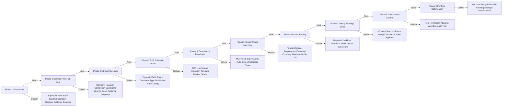

# 09 — Development Roadmap

## Purpose

Roadmap ini menyusun fasa pembangunan supaya sistem dibina secara modular, tidak hardcoded dan boleh dikembangkan tanpa perlu rebuild dari kosong.

## Roadmap Workflow

## Phase 1 — Foundation

Deliverables:

- Next.js platform shell
- Supabase connection
- Auth base
- Company register
- Evidence register
- Compact admin layout
- Base audit structure

## Phase 2 — Company InfoHub Core

Deliverables:

- Company Passport
- SSM & legal info
- Governance, bank, staff, project experience sections
- Evidence mapping
- Completion dashboard

## Phase 2.5 — Flexibility Layer

Deliverables:

- Dynamic Field Engine
- Status Builder
- Document Type Builder
- Soft Delete / Recycle Bin / Restore
- Schema Versioning
- Config permission for Super Admin

This phase must come early. If dynamic field and safe delete are built late, other modules may need major rewrite.

## Phase 3 — PDF Evidence Intake

Deliverables:

- PDF upload/link
- Google Drive metadata
- document type detection
- extraction template
- evidence review queue
- mismatch/correction queue

## Phase 4 — Compliance & Readiness

Deliverables:

- MOF module
- CIDB module
- statutory compliance
- expiry alert
- rule-driven readiness scoring
- portfolio tiering

## Phase 5 — Tender Intake & Matching

Deliverables:

- tender register
- tender requirement extraction
- company eligibility engine
- Green / Amber / Red / Grey status
- Go / No-Go memo

## Phase 6 — Output Factory

Deliverables:

- output template versioning
- compliance checklist generator
- evidence index generator
- tender pack generator
- PDF / DOCX / Excel export structure

## Phase 7 — Pricing Strategy Desk

Deliverables:

- costing templates
- statutory rates
- scenario pricing
- final price approval
- pricing summary output

## Phase 8 — Governance Control

Deliverables:

- role permission
- approval workflow
- audit log
- deletion log
- management decision record

## Phase 9 — Portfolio Optimization

Deliverables:

- portfolio command centre
- win/loss learning
- company ranking
- renewal/action planning
- tender strategy improvement

## DONE -> NEXT STEP

Roadmap ini menjadi sequence pembangunan. Development task selepas ini perlu dibuat mengikut phase, bukan ikut idea rawak.
