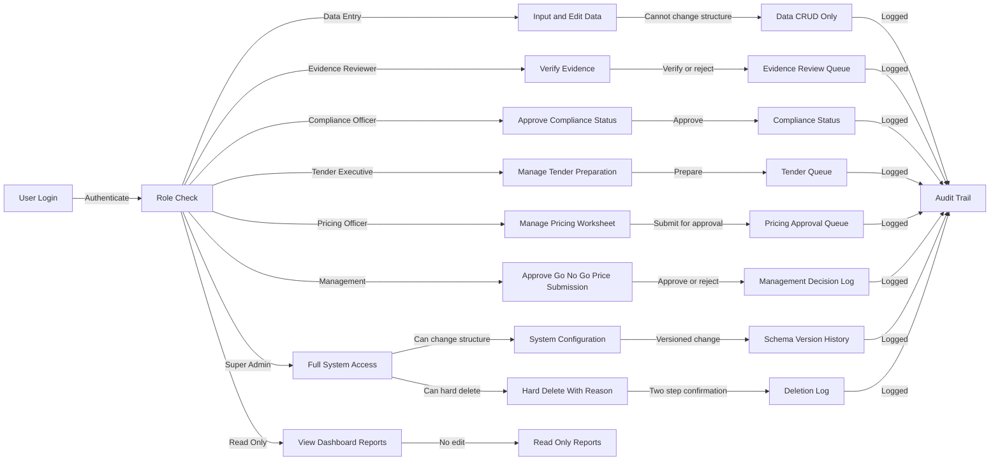

# 10 — User Role & Permission Flow

## Purpose

Modul ini menentukan kawalan akses sistem supaya setiap pengguna hanya boleh menjalankan tindakan yang sesuai dengan peranan masing-masing. Ini penting kerana sistem mengandungi data syarikat, evidence, pricing, tender decision, output rasmi dan fungsi delete yang sensitif.

## Roles

1. Super Admin
2. Data Entry
3. Evidence Reviewer
4. Compliance Officer
5. Tender Executive
6. Pricing Officer
7. Management
8. Read Only

## Workflow



## Permission Matrix

| Role | Main Access | Structure Config | Approval | Hard Delete |
|---|---|---:|---:|---:|
| Super Admin | All modules | Yes | Yes | Yes |
| Data Entry | Company/evidence input | No | No | No |
| Evidence Reviewer | Evidence review | No | Evidence only | No |
| Compliance Officer | Compliance status | No | Compliance only | No |
| Tender Executive | Tender preparation | No | No | No |
| Pricing Officer | Pricing worksheet | No | Submit only | No |
| Management | Decision/approval dashboard | No | Yes | No |
| Read Only | View only | No | No | No |

## Key Database Tables

- `users`
- `roles`
- `role_permissions`
- `module_permissions`
- `approval_workflows`
- `approval_records`
- `audit_logs`
- `deletion_log`

## UI Routes

```text
/admin/users
/admin/roles
/admin/permissions
/approvals
/audit
```

## Rules

- Only Super Admin can change system configuration.
- Pricing final cannot enter submission pack before approval.
- Go/No-Go must be recorded before tender preparation begins.
- All verification, approval and deletion actions must be logged.
- Hard delete requires reason and two-step confirmation.

## DONE -> NEXT STEP

Permission control must be enforced both in UI and Supabase RLS/API layer.
