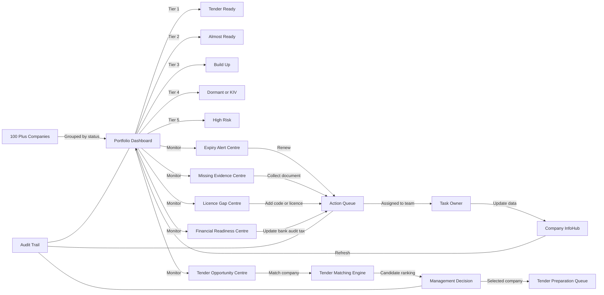

# 11 — Portfolio Command Centre

## Purpose

Portfolio Command Centre ialah dashboard induk untuk mengurus 100+ syarikat. Ia bukan sekadar list company, tetapi pusat kawalan untuk melihat readiness, expiry, missing evidence, licence gap, financial readiness, tender opportunity dan action owner.

## Main Functions

- classify companies by tier;
- monitor expiry and missing documents;
- show licence/capability gaps;
- assign action to team;
- connect portfolio status to tender opportunity;
- support management decision on which company to use.

## Workflow



## Tier Definition

| Tier | Meaning | Action |
|---|---|---|
| Tier 1 | Tender Ready | Use for matching and tender pursuit |
| Tier 2 | Almost Ready | Fix minor missing items |
| Tier 3 | Build-Up | Build evidence/licence/capability |
| Tier 4 | Dormant / KIV | Monitor only |
| Tier 5 | High Risk | Do not use until resolved |

## Key Database Tables

- `companies`
- `readiness_scores`
- `expiry_alerts`
- `missing_evidence_items`
- `licence_gaps`
- `action_queue`
- `task_assignments`
- `portfolio_snapshots`
- `audit_logs`

## UI Routes

```text
/
/portfolio
/portfolio/tier
/portfolio/alerts
/portfolio/action-queue
/portfolio/opportunities
```

## Output Generated

- Portfolio Readiness Dashboard
- Expiry Alert Report
- Missing Evidence Report
- Licence Gap Report
- Action Queue List
- Company Ranking
- Management Portfolio Summary

## DONE -> NEXT STEP

Portfolio dashboard perlu mendapat data daripada Company InfoHub, Compliance Engine, Evidence Vault dan Tender Matching Engine.
