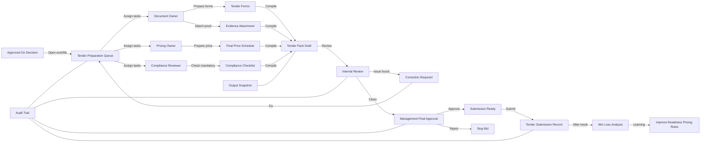

# 12 — Tender Submission Control

## Purpose

Modul ini mengawal proses akhir tender supaya dokumen, evidence, harga, approval dan submission record lengkap sebelum dihantar.

Ia berfungsi sebagai pagar akhir sebelum submission.

## Sub-Modules

1. Tender Preparation Queue
2. Task Assignment
3. Tender Forms Preparation
4. Evidence Attachment Check
5. Pricing Schedule Check
6. Compliance Checklist
7. Internal Review
8. Management Final Approval
9. Submission Record
10. Win/Loss Analysis

## Workflow



## Key Database Tables

- `tender_preparation_tasks`
- `tender_pack_items`
- `submission_checklists`
- `submission_reviews`
- `management_approvals`
- `submission_records`
- `win_loss_analysis`
- `generated_outputs`
- `audit_logs`

## UI Routes

```text
/tenders/[id]/preparation
/tenders/[id]/submission-check
/tenders/[id]/approval
/tenders/[id]/submission-record
/tenders/[id]/result
```

## Rules

- Tender pack cannot be marked submission-ready if mandatory requirement has missing evidence.
- Pricing must be approved before final output lock.
- Output pack must store snapshot version.
- Submission record must capture date, method, person in charge and submitted file/output reference.
- Result must be recorded for win/loss learning.

## Output Generated

- Submission Checklist
- Final Tender Pack Index
- Approval Memo
- Submission Record
- Win/Loss Analysis
- Improvement Action List

## DONE -> NEXT STEP

Modul ini menyambung Output Factory, Pricing Approval dan Tender Matching kepada proses submission sebenar.
