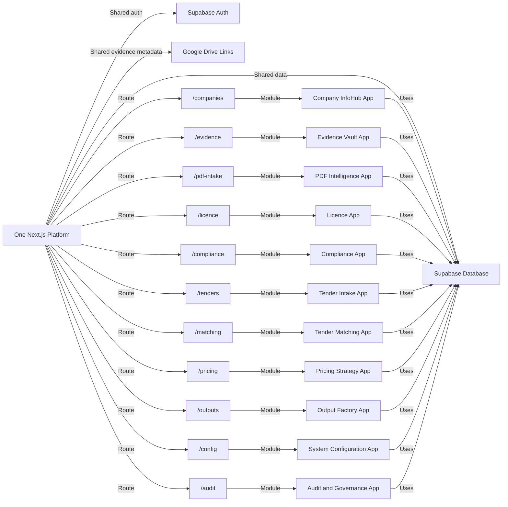

# 13 — Modular App Route Map

## Purpose

Dokumen ini memetakan semua modul kepada route dalam satu platform Next.js. Prinsip architecture ialah satu platform induk dengan banyak mini-app/module, bukan banyak app berasingan pada fasa awal.

## Principle

```text
One Next.js Platform + Shared Supabase + Shared Evidence Vault + Shared Audit Trail
```

## Route Map Workflow



## Route Groups

### Core Platform

```text
/
/api-test
/audit
/config
```

### Company & Evidence

```text
/companies
/companies/new
/companies/[id]
/companies/[id]/passport
/evidence
/evidence/new
/pdf-intake
/documents/review
```

### Licence & Compliance

```text
/ssm
/cidb
/mof
/licence
/compliance
/readiness
/matrix
```

### Tender Operations

```text
/tenders
/tenders/new
/tenders/[id]
/tenders/[id]/requirements
/tenders/[id]/matching
/tenders/[id]/go-no-go
/tenders/[id]/preparation
/tenders/[id]/submission
```

### Pricing & Output

```text
/pricing
/pricing/templates
/tenders/[id]/pricing
/outputs
/outputs/templates
/tenders/[id]/outputs
```

## Existing Modules That Can Be Reused

| Existing Route | New Role |
|---|---|
| `/` | Portfolio Command Centre |
| `/companies` | Company InfoHub / Company Master |
| `/evidence` | Evidence Vault App |
| `/preq` | Verification Queue / Compliance Review |
| `/matrix` | Compliance Matrix / Requirement Mapping |
| `/readiness` | Readiness Engine Basic |
| `/ssm` | SSM & Legal Info Module |
| `/cidb` | CIDB Register / Licence Module |
| `/tender-rules` | Tender Requirement Register |
| `/api-test` | Backend Connectivity Test Layer |

## DONE -> NEXT STEP

Route map ini menjadi asas untuk refactor app sedia ada kepada modular operating system.
